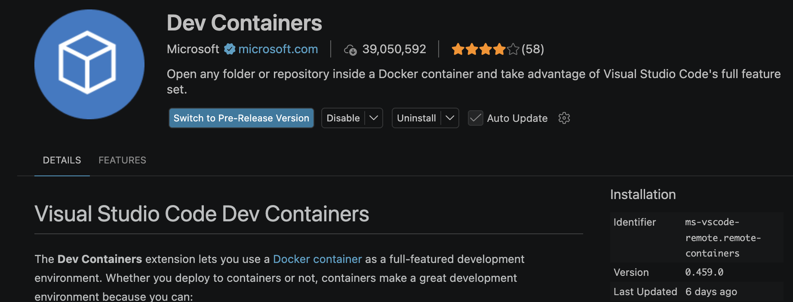

# To Run the Backend

Download Docker Desktop: 

`https://www.docker.com/products/docker-desktop/`

After downloading docker desktop create a Docker image using the command below:

`docker build -t ucigeoguesser --target builder .`

Run the docker image to create a container

`docker run -p 18080:18080 -d --name backend -v .:/backend ucigeoguesser sleep infinity`

Execute the container 

`docker exec -it backend bash ` or `docker exec -it backend ./build/backend`

# To Run CMake in Docker (Not Necessary If Runned by Docker)

Initialize Build Directory:

`cmake -B build -S . -DCMAKE_TOOLCHAIN_FILE=/vcpkg/scripts/buildsystems/vcpkg.cmake`

Compile the build

`cmake --build build `

# To Authenticate Google Cloud

Authenticate using google account login:

`gcloud auth application-default login`

# Recommendations

We recommend you to utilize the Dev Container extension to manage the backend.

Once installed, `Cmd + Shift + P` or `Control + Shift + P` to enter command palette.

Search `Attach to Running Container..` and select backend.